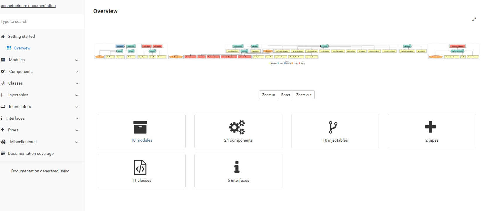

[](https://asadsahi.visualstudio.com/playground/_build/index?context=allDefinitions&path=%5C&definitionId=7&_a=completed)
[](https://gitter.im/asadsahi-AspNetCoreSpa/Lobby?utm_source=badge&utm_medium=badge&utm_campaign=pr-badge&utm_content=badge)
[](http://opensource.org/licenses/MIT)

## Features

* [ASP.NET Core](http://www.dot.net/)
* [Entity Framework Core](https://docs.efproject.net/en/latest/)
    * Both Sql Server and Sql lite databases are supported (Check installation instrcutions for more details)
* [Angular](https://angular.io/)
* [Angular CLI](https://cli.angular.io/)
* Secure - with CSP and custom security headers
* [Bootstrap 4](http://v4-alpha.getbootstrap.com/)
* [SignalR](https://github.com/aspnet/SignalR/) (Chat example)
* [SASS](http://sass-lang.com/) support
* [Best practices](https://angular.io/docs/ts/latest/guide/style-guide.html) in file and application organization for Angular.
* [PWA support](https://developers.google.com/web/progressive-web-apps/)
* [SSR (Server side rendering)](https://angular.io/guide/universal) - Coming soon...
* Testing Angular code with [Jasmine](http://jasmine.github.io/) and [Karma](https://karma-runner.github.io/0.13/index.html).
* E2E testing with [Protractor](http://www.protractortest.org).
* [Compodoc](https://compodoc.github.io/compodoc/) for Angular documentation
* Login and Registration functionality using [Asp.Net Identity & JWT](https://docs.asp.net/en/latest/security/authentication/identity.html)
* Token based authentication using [Openiddict](https://github.com/openiddict/openiddict-core)
     * Get public key access using: http://127.0.0.1:5000/.well-known/jwks
* Extensible User/Role identity implementation
* Social logins support with token based authentication, Follow [this](https://github.com/asadsahi/AspNetCoreSpa/wiki/Social-Login-Setup) wiki page to see how it will work.
* [Angular dynamic forms](https://angular.io/docs/ts/latest/cookbook/dynamic-form.html) for reusability and to keep html code DRY.
* [Swagger](http://swagger.io/) as Api explorer (Visit url **http://127.0.0.1:5000/swagger** after running the application). More [details](https://github.com/domaindrivendev/Swashbuckle.AspNetCore)
 
## NOTE: (This is the new Angular cli based branch where ClientApp is completely managed by Angular cli. If you are interested in previous cli branch where integration of Angular cli was minimal (only for code generation), then switch to [angular-non-cli](https://github.com/asadsahi/AspNetCoreSpa/tree/angular-non-cli) branch)

## Pre-requisites

1. [.Net core sdk](https://www.microsoft.com/net/core#windows)
2. Either [VSCode](https://code.visualstudio.com/) with [C#](https://marketplace.visualstudio.com/items?itemName=ms-vscode.csharp) extension OR [Visual studio 2017](https://www.visualstudio.com/)
3. [Nodejs](https://nodejs.org/en/)

**Make sure you have Node version >= latest LTS and NPM >= latest LTS

## Installation
```
1. Clone the repo
    git clone https://github.com/asadsahi/AspNetCoreSpa
2. Change directory
    cd AspNetCoreSpa
3. dotnet restore
4. Install global dependencies
    npm install protractor rimraf http-server @angular/cli -g
5. cd ClientApp
6. npm install OR yarn
7. Run 
    i) Open terminal and run `npm start`
    ii) F5 from either [VScode] (https://code.visualstudio.com/) or [Visual Studio IDE](https://www.visualstudio.com/):

8. Point to Sqllite or SqlServer
    
This project supports both sql server and sql lite databases

* Run with Sqlite:
    * Project is configured to run with sqlite by default and there is an 'Initial' migration already added (see Migrations folder)
    * After changing you models, you can add additional migrations 
    [see docs](https://docs.microsoft.com/en-us/ef/core/miscellaneous/cli/dotnet)

* Run with SqlServer:
    * To run under sql server:
        * npm run clean
        * Delete `Migrations` folder
        * Flip the switch in appsettings.json called `useSqLite` to `false`, this should point to use local sql server setup as default instance. (See appsettings.json file for connection string)
        * Run `dotnet ef migrations add "InitialMigrationName"`

```

## Other commands

### Scaffold Angular components using Angular CLI

Scaffold  | Usage
---       | ---
Component | `ng g component my-new-component`
Directive | `ng g directive my-new-directive`
Pipe      | `ng g pipe my-new-pipe`
Service   | `ng g service my-new-service`
Class     | `ng g class my-new-class`
Guard     | `ng g guard my-new-guard`
Interface | `ng g interface my-new-interface`
Enum      | `ng g enum my-new-enum`
Module    | `ng g module my-module`

### run Angular tests
```bash
cd ClientApp

npm test
```
### Compodoc Angular documentation
 * Steps to generate:
    * npm i compodoc -g
    * npm run compodoc
    * cd documentation
    * http-server

Compodoc documentation: 

```
### run end-to-end tests
```bash
# make sure you have your server running in another terminal (i.e run "dotnet run" command)
npm run e2e
```
### run Protractor's elementExplorer (for end-to-end)
```bash
npm run webdriver:start
# in another terminal
npm run e2e:live
```
# Compatability
 * This project is supported in everygreen browsers and IE10+
 * IE8 & IE9 aren't supported since Bootstrap 4 is supported in IE10+ [explained here](http://v4-alpha.getbootstrap.com/getting-started/browsers-devices/).

# Azure Deploy
* You can set an environment variable for azure app deployment password
Set-Item -path env:AzureAppPass -value passwordhere
```
From powershell:
./deploy-azure.ps1
```
# Deploy to heroku using its container service
### Replace your app name where it is `aspnetcorespa`
* dotnet publish -c release
* docker build -t aspnetcorespa ./bin/release/netcoreapp2.0/publish
* heroku login
* heroku container:login
* docker tag aspnetcorespa registry.heroku.com/aspnetcorespa/web
* docker push registry.heroku.com/aspnetcorespa/web
Note: There is a `deploy.heroku.ps1` script included with this project which automates above steps.

# Deploy to Azure as App Service
Set-Item -path env:AzureAppPass -value passwordhere
```
From powershell:
./deploy-azure.ps1
```

---

[](https://www.paypal.com/cgi-bin/webscr?cmd=_s-xclick&hosted_button_id=RB7XESV8CP7GW)
